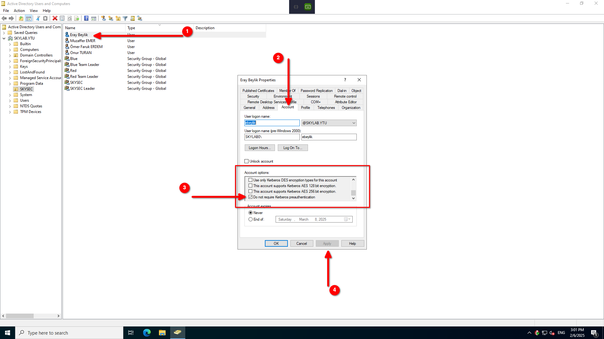

# Initial

`80` portunda çalışan web sitesinde kullanıcı adlarını doğru kombinasyonları wordlist oluşturacak şekilde kullandıktan sonra verilen IP adresindeki Domain Controllera [kerberoasting](https://attack.mitre.org/techniques/T1558/003/) saldırısı gerçekleştirilmelidir.
Araç olarak [kerbrute](https://github.com/TarlogicSecurity/kerbrute) veya Kali Linux ile beraber gelen `impacket-GetNPUsers` kullanılabilir.

```bash
impacket-GetNPUsers -dc-ip 10.10.10.100 -format john -outputfile hashes -usersfile users  skylab.ytu/
```
Örnek komut ile oluşturulan kullanıcı adı wordlistindeki kullanıcılar Domain Controller tarafından `krbgt5` hashleri talep edilir ve `ebeylik` kullanıcısına ait hash değeri alınır. Hash değeri `john` aracıyla kırılır ve SMB girişi sağlanır.

Bu güvenlik açığını sağlamak için `ebeylik` kullanıcısının `Active Directory Users and Computers` panelinden niteliklerine girilerek `Accounts` bölümünden `Accounts Options` kısmında `Do not require Kerberos preauthentication` tiki işaretlenmelidir.




# SMB
`ebeylik` kullanıcısına ait `krbgt5` hashini kırdıktan sonra elde edilen şifre ile `smbclient` ya da `crackmapexec` araçlarını kullanarak enumeration gerçekleştirdikten sonra bir adet SMB Share erişimi olduğu görülecek.

```bash
smbclient -U 'ebeylik%şifre' -L //10.10.10.150/
```
komutu ile hangi Share'a erişimi olduğu görülebilir.

```bash
smbclient -U 'ebeylik%şifre' //10.10.10.150/Red
```

komutu ile SMB Share'a girilir ve `accounts.ods` dosyasına erişimi olduğu görülür. Dosyayı indirip açtığında birtakım kullanıcılara ait kullanıcı adı ve şifre bilgilerini içerdiği görülmektedir.

# MSSQL
Bu kullanıcılar arasından `SA` kullanıcısına ait bilgiler geçerlidir. `SA` kullanıcısı Microsoft MSSQL sunucusundaki `default` kullanıcıya ait kullanıcı adıdır. Bu bilgileri kullanarak `impacket-mssqlclient` veya `sqlcmd` programları kullanılarak SQL sunucusuna giriş yapılabilir.

```bash
impacket-mssqlclient sa:'P@ssw0rd!'@10.10.10.150
```
örnek bir komut kullanımıdır.

Giriş yapılmasının ardından `xp_cmdshell` aktif edilerek `xp_cmdshell` komutu ile makine içerisinde komut çalıştırılabilmektedir, bu sayede reverse shell elde edilecektir.

# Port Forward
Makine içerisinde analizler gerçekleştirildiğinde `127.0.0.1` adresinin `5000` portunda bir servis çalıştığı görülmektedir. `msfconsole` veya `chisel` araçları ile bu adres ve portta çalışan servis kullanıcının makinesine yönlendirilerek erişir ve içerisindeki erişilmemesi gereken konfigürasyon dosyaları okunur. Bu işlem `gobuster` veya `ffuf` araçları ile arama yapılarak gerçekleştirilebilir.
Elde edilen konfigürasyon dosyası ile `oturan` kullanıcısına ait bilgiler ele geçirilir ve bir sonraki aşamaya geçilir.

# AD DACL
`Bloodhound` aracı ile `oturan` kullanıcısı bilgilerini kullanarak gerekli analizler gerçekleştirildiğinde `oturan` kullanıcısının `Blue Team Leader` grubuna kullanıcı ekle/çıkar yetkisinin olduğu görülecektir, herhangi bir kullanıcı `Blue Team Leader` grubuna dahil edilerek bir sonraki aşamaya geçilir.

`Blue Team Leader` kullanıcısının `SKY-SEC Team Leader` kullanıcısına ait `Golden Ticket` bilgilerini alma yetkisinin olduğu görülür ve `ferdem` kullanıcısına ait `Golden Ticket` alınarak ele geçirilir.

`ferdem` kullanıcısının `Domain Admins` grubuna yazma izni vardır ve `Administrator` kullanıcısının şifresini değiştirerek ele geçirilir. 
