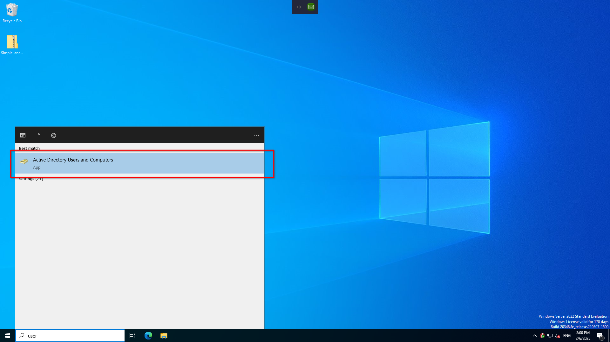

# Initial

`80` portunda çalışan web sitesinde kullanıcı adlarını doğru kombinasyonları wordlist oluşturacak şekilde kullandıktan sonra verilen IP adresindeki Domain Controllera [kerberoasting](https://attack.mitre.org/techniques/T1558/003/) saldırısı gerçekleştirilmelidir.
Araç olarak [kerbrute](https://github.com/TarlogicSecurity/kerbrute) veya Kali Linux ile beraber gelen `impacket-GetNPUsers` kullanılabilir.

```bash
impacket-GetNPUsers -dc-ip 10.10.10.100 -format john -outputfile hashes -usersfile users  skylab.ytu/
```
Örnek komut ile oluşturulan kullanıcı adı wordlistindeki kullanıcılar Domain Controller tarafından `krbgt5` hashleri talep edilir ve `ebeylik` kullanıcısına ait hash değeri alınır. Hash değeri `john` aracıyla kırılır ve SMB girişi sağlanır.

Bu güvenlik açığını sağlamak için `ebeylik` kullanıcısının `Active Directory Users and Computers` panelinden niteliklerine girilerek `Accounts` bölümünden `Accounts Options` kısmında `Do not require Kerberos preauthentication` tiki işaretlenmelidir.



