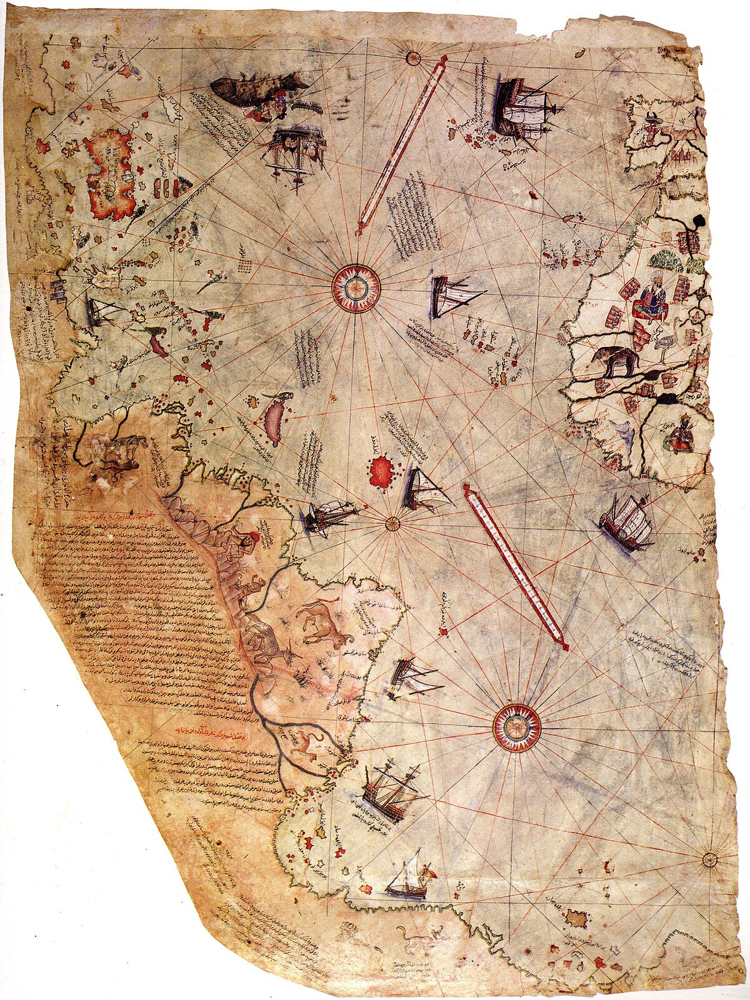

Efsaneye göre, Piri Reis haritasına yalnızca coğrafi bilgileri değil, aynı zamanda gizli bir mesaj da ekledi. Ancak bu mesaj gözle görünmez bir şekilde haritaya işlenmişti. Yıllar sonra, bir araştırmacı, Piri Reis'in notlarının kayıp bir versiyonunu içeren bir harita parçası buldu.

"Bu notlar, yalnızca yüzeydeki verilerden değil, aynı zamanda Piri Reis'in haritaya eklediği şifreli bir tarihsel sırrı da içeriyor. Şifreyi çözmek için haritanın şifreli anahtarını anlaman gerekecek. Belki de 1513 yılını tekrar gözden geçirmelisin."